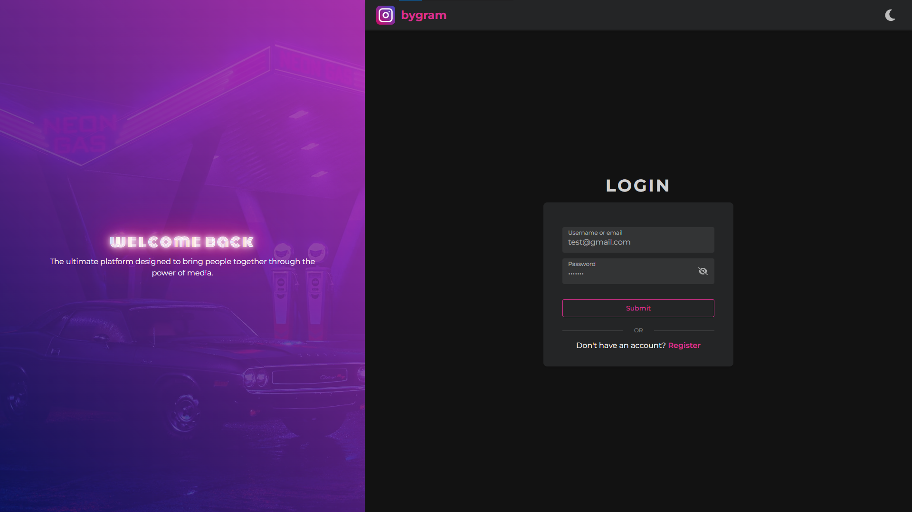

<a name="readme-top"></a>

<!-- PROJECT LOGO -->
<br />
<div align="center">
  <a href="readme-resources/logo.svg">
    
  </a>

  <h3 align="center">Social Media Platform</h3>

  <p align="center">
    A modern social media platform to share moments and connect with the world!
    <br />
    <a href="https://youtu.be/0YJ7lPvjlAo"><strong>Watch Demo »</strong></a>
    <br />
    <br />
    <a href="https://docs.google.com/forms/d/1oUM87A2Kkv7ME9OhRtNDZ_HyMsoKzJR_lOCwna4T_rU/viewform?edit_requested=true">Report Bug</a>
    ·
    <a href="https://docs.google.com/forms/d/1Buxc42n_T9O5ELi6t2nj0SGoZE1yg675G625TSSLJcA/viewform?pli=1&pli=1&edit_requested=true">Request Feature</a>
  </p>
</div>

<!-- TABLE OF CONTENTS -->
<details>
  <summary>Table of Contents</summary>
  <ol>
    <li>
      <a href="#about-the-project">About The Project</a>
      <ul>
        <li><a href="#built-with">Built With</a></li>
      </ul>
    </li>
    <li>
      <a href="#getting-started">Getting Started</a>
      <ul>
        <li><a href="#prerequisites">Prerequisites</a></li>
        <li><a href="#installation">Installation</a></li>
      </ul>
    </li>
    <li><a href="#usage">Usage</a></li>
    <li><a href="#license">License</a></li>
    <li><a href="#contact">Contact</a></li>
  </ol>
</details>

<!-- ABOUT THE PROJECT -->

## About The Project



**Bygram** is a dynamic and user-friendly social media platform designed for sharing images, videos, and connecting with others. Built as a personal learning project, Bygram combines modern web technologies with a focus on clean code, responsive design, and an engaging user experience. Whether you're posting moments, exploring content, or connecting with friends, Bygram provides a seamless and visually appealing platform.

### Key Features:
- **Secure Authentication**: Robust user authentication with JWT and bcrypt for password hashing.
- **Media Uploads**: Effortless image and video uploads powered by Cloudinary.
- **Responsive UI**: Fully responsive design with dark mode support, styled with Tailwind CSS and Sass for advanced effects (e.g., shadows, neon glows).

This project is ideal for developers looking to explore a full-stack social media application or for users seeking a modern platform to share and connect.

<p align="right">(<a href="#readme-top">back to top</a>)</p>

### Built With

Bygram leverages a powerful stack of modern technologies to deliver a robust and scalable platform:

- [![React][React.js]][React-url]
- [![Express][Express.js]][Express-url]
- [![Sass][Sass.js]][Sass-url]
- [![TailwindCSS][TailwindCSS.js]][TailwindCSS-url]
- [![MongoDB][MongoDB.js]][MongoDB-url]
- [![Redis][Redis.js]][Redis-url]
- [![Cloudinary][Cloudinary.js]][Cloudinary-url]
- [![TypeScript][TypeScript.js]][TypeScript-url]

<p align="right">(<a href="#readme-top">back to top</a>)</p>

<!-- GETTING STARTED -->

## Getting Started

Follow these steps to set up and run Bygram locally on your machine.

### Prerequisites

Ensure you have the following installed:

- **Node.js** (v16 or higher) and **npm** (or pnpm, yarn).
- **MongoDB**: A running MongoDB instance (local or cloud-based).
- **Redis**: A running Redis server for session management.
- **Cloudinary Account**: For media storage and management.

### Installation

1. Clone the repo:
   ```sh
   git clone https://github.com/byronncat/bygram.git
   cd bygram
   ```
2. Install dependencies:
   ```sh
   npm install
   ```
3. Set up environment variables:
   - Create a `.env` file in both the `api` and `client` directory.
   - Copy the example variables from `.env.example` and fill in the required values.
4. Start the development server:
   ```sh
   cd api
   npm run dev
   ```
5. Start the development client:
   ```sh
   cd client
   npm run start
   ```
6. Access the Application:
  - Open your browser and navigate to http://localhost:3000 (or the port specified in your client configuration).

<p align="right">(<a href="#readme-top">back to top</a>)</p>

<!-- USAGE EXAMPLES -->

## Usage

- **Explore Posts**: Browse a feed of posts from users across the platform.
- **Create Content**: Share images or videos with captions to express yourself.
- **Search**: Use the search bar to find users or specific posts.
- **Profile Management**: Update your profile picture, and view your posts or those of others.

<p align="right">(<a href="#readme-top">back to top</a>)</p>

<!-- LICENSE -->

## License

Distributed under the MIT License. See `LICENSE` for more information.

<p align="right">(<a href="#readme-top">back to top</a>)</p>

<!-- CONTACT -->

## Contact

Ngo Cao Anh Thinh - anhthinhncat@gmail.com

Project Link: [Bygram](https://bygram.netlify.app)

<p align="right">(<a href="#readme-top">back to top</a>)</p>


<!-- MARKDOWN LINKS & IMAGES -->
<!-- https://www.markdownguide.org/basic-syntax/#reference-style-links -->

[contributors-shield]: https://img.shields.io/github/contributors/your_username/your_repo_name.svg?style=for-the-badge
[contributors-url]: https://github.com/your_username/your_repo_name/graphs/contributors
[forks-shield]: https://img.shields.io/github/forks/your_username/your_repo_name.svg?style=for-the-badge
[forks-url]: https://github.com/your_username/your_repo_name/network/members
[stars-shield]: https://img.shields.io/github/stars/your_username/your_repo_name.svg?style=for-the-badge
[stars-url]: https://github.com/your_username/your_repo_name/stargazers
[issues-shield]: https://img.shields.io/github/issues/your_username/your_repo_name.svg?style=for-the-badge
[issues-url]: https://github.com/your_username/your_repo_name/issues
[license-shield]: https://img.shields.io/github/license/your_username/your_repo_name.svg?style=for-the-badge
[license-url]: https://github.com/your_username/your_repo_name/blob/master/LICENSE.txt
[linkedin-shield]: https://img.shields.io/badge/-LinkedIn-black.svg?style=for-the-badge&logo=linkedin&colorB=555
[linkedin-url]: https://linkedin.com/in/your_username
[product-screenshot]: resources/product-screenshot.png
[Express.js]: https://img.shields.io/badge/Express.js-000000?style=for-the-badge&logo=express&logoColor=white
[Express-url]: https://expressjs.com/
[React.js]: https://img.shields.io/badge/React-20232A?style=for-the-badge&logo=react&logoColor=61DAFB
[React-url]: https://react.dev/
[TypeScript.js]: https://img.shields.io/badge/TypeScript-3178C6?style=for-the-badge&logo=typescript&logoColor=white
[TypeScript-url]: https://www.typescriptlang.org/
[MongoDB.js]: https://img.shields.io/badge/MongoDB-47A248?style=for-the-badge&logo=mongodb&logoColor=white
[MongoDB-url]: https://www.mongodb.com/
[Redis.js]: https://img.shields.io/badge/Redis-DC382D?style=for-the-badge&logo=redis&logoColor=white
[Redis-url]: https://redis.io/
[Cloudinary.js]: https://img.shields.io/badge/Cloudinary-3448C5?style=for-the-badge&logo=cloudinary&logoColor=white
[Cloudinary-url]: https://cloudinary.com/
[TailwindCSS.js]: https://img.shields.io/badge/Tailwind_CSS-38B2AC?style=for-the-badge&logo=tailwind-css&logoColor=white
[TailwindCSS-url]: https://tailwindcss.com/
[Sass.js]: https://img.shields.io/badge/Sass-CC6699?style=for-the-badge&logo=sass&logoColor=white
[Sass-url]: https://sass-lang.com/
